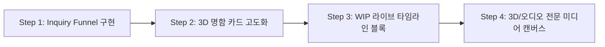

# BlockCanvas 포트폴리오 기능 확장 제안서 (Killer Feature Proposals)
> **작성일**: 2026년 5월 23일  
> **기획자**: Antigravity (Senior Product Manager & Architect)

---

## 1. 배경 및 비전 (Background & Vision)
현재 **BlockCanvas**는 비주얼과 드래그 앤 드롭의 사용성 면에서 이미 국내외 최고 수준의 품질을 자랑하고 있습니다. 그러나 단순한 **"레이아웃이 예쁜 노코드 페이지"**를 넘어, 크리에이터들이 실제로 기존의 Notion, Linktree, Webflow, Behance를 탈피해 BlockCanvas를 자신들의 **주 거점 포트폴리오**로 채택하게 만들려면 플랫폼 고유의 **"킬러 기능(Killer Features)"**이 탑재되어야 합니다.

크리에이터들이 포트폴리오를 운영하는 궁극적 목적은 **"자신의 브랜딩 극대화"**와 **"실질적인 비즈니스 기회(협업, 외주, 채용) 획득"**입니다. 이 두 가지 목적에 초점을 맞추어 BlockCanvas에 즉각 탑재할 것을 권장하는 **4대 혁신 포트폴리오 기능**을 제안합니다.

---

## 2. 킬러 기능 제안 (4 Core Killer Features)

### 🚀 1. 인터랙티브 '3D 홀로그램 명함 카드' 블록
*   **기능 개요**: 포트폴리오 최상단 프로필 영역(`BusinessCardContact`)을 극도로 현대적이고 인터랙티브한 **3D 홀로그램 카드** 형태로 커스텀할 수 있게 만듭니다.
*   **세부 구현 내용**:
    - **자이로스코프 & 마우스 호버 틸트**: 모바일 자이로스코프 및 데스크톱 마우스 무브에 반응하여 카드가 3D 각도로 부드럽게 기우는 효과 (`Vanilla-Tilt` 기반).
    - **글래스모피즘 & 홀로그램 호일 필터**: 마우스 각도에 따라 카드의 하이라이트 광원과 무지개색 홀로그램 패턴이 다채롭게 일렁이는 셰이더 효과.
    - **가치**: 포트폴리오 첫 화면에서 크리에이터의 시각적 완성도와 트렌디함을 0.5초 만에 각인시키는 최강의 브랜딩 와우 포인트(WOW Point).

### 💬 2. 실시간 외주 제안 및 클라이언트 소통 채널 (Inquiry Funnel)
*   **기능 개요**: 방문자나 예비 클라이언트가 포트폴리오를 둘러보다가 즉시 크리에이터에게 정형화된 제안서/문의를 보낼 수 있는 **"비즈니스 리드 획득 폼(Inquiry Form) 블록"**입니다.
*   **세부 구현 내용**:
    - **정교한 문의 필터**: 예산 범위, 작업 종류(일러스트, 개발, UI/UX 등), 희망 마감일을 쉽게 입력할 수 있는 템플릿 제공.
    - **실시간 알림**: 문의가 접수되면 크리에이터의 대시보드 메시지함(`MessagesDashboardClient`)으로 즉시 동기화되며, 크리에이터에게 이메일/푸시 알림 전송.
    - **가치**: 포트폴리오를 정적 전시관에서 **"실시간 수익 창출 창구"**로 전환시켜 플랫폼 이탈을 완벽하게 방지하는 락인(Lock-in) 장치.

### 🛠️ 3. 실시간 작업 프로세스 타임라인 (WIP: Work In Progress)
*   **기능 개요**: 완성된 작품뿐만 아니라, 현재 고민 중인 스케치, 코딩 스니펫, 3D 모델링 과정 등을 인스타그램 스토리처럼 가볍게 아카이빙할 수 있는 **"라이브 타임라인 블록"**입니다.
*   **세부 구현 내용**:
    - **일지형 타임라인 레이아웃**: 날짜별로 가벼운 텍스트와 슬라이드 이미지를 카드 형태로 덧붙여 나가는 심플한 로그 시스템.
    - **완성작 연동**: WIP 로그들이 모여 최종 프로젝트 포트폴리오 카드로 원클릭 변환되는 유기적 저작 아키텍처.
    - **가치**: 포트폴리오가 1년에 한두 번 업데이트되는 정적인 공간에서 크리에이터의 일상이 흐르는 **"살아있는 라이브 워크스페이스"**로 진화하여 팬들과 클라이언트의 재방문율 극대화.

### 🎨 4. 프로페셔널 미디어 전용 임베드 캔버스
*   **기능 개요**: 단순 이미지와 유튜브 링크를 넘어, 고사양 디지털 미디어를 포트폴리오 브라우저 내에서 완벽하게 감상할 수 있는 전문 미디어 특화 블록입니다.
*   **세부 구현 내용**:
    - **Figma & 3D Spline Viewer**: 피그마 프로토타입이나 Spline 3D 인터랙티브 오브젝트를 반응형 캔버스로 즉시 로드.
    - **웨이브 오디오 플레이어**: 사운드 디자이너, 뮤지션들을 위해 오디오 파형(Waveform)을 실시간으로 렌더링하고 재생해주는 시각화 오디오 블록.
    - **가치**: 디자인 장르를 넘나드는 모든 크리에이터의 원본 자산을 압도적 비주얼로 표현해주는 유일무이한 노코드 도구로 격상.

---

## 3. 종합 추천 로드맵 (Action Plan)

제안드린 기능들은 다음과 같은 단계로 구현하여 비즈니스 적합성을 빠르게 검증하는 것이 좋습니다.

1.  **Phase 1 (우선순위 최상)**: **Inquiry Funnel**
    - 이미 프로젝트 내에 `MessagesDashboardClient` 등 대시보드 메시지 기반이 일부 갖추어져 있으므로, 포트폴리오 하단에 즉시 "외주/제안 문의하기" 입력 폼 블록을 탑재하고 DB 릴레이션을 설계해 연동하는 것이 비즈니스 시너지가 가장 빠릅니다.
2.  **Phase 2**: **3D 홀로그램 명함 카드**
    - 기존 `BusinessCardContact` 컴포넌트를 카드 틸트 이펙트로 고도화하여 시각적 "WOW" 만족도를 충족시킵니다.
3.  **Phase 3**: **WIP 타임라인 & 미디어 캔버스**
    - 플랫폼 규모 확장 및 매니악한 프로 디자이너들을 사로잡는 장기 고도화 스키마로 발전시킵니다.
