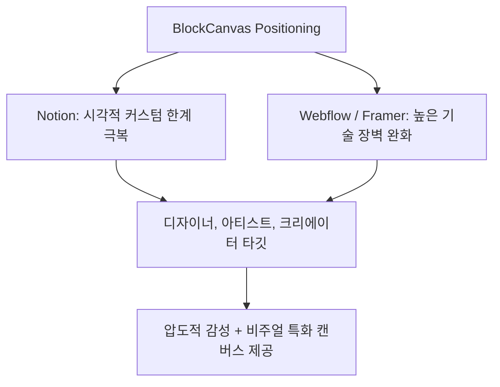

# BlockCanvas 종합 UX/UI 및 기술 가용성 평가 보고서
> **작성일**: 2026년 5월 23일  
> **평가인**: Antigravity (Senior UX/UI Architect & System Engineer)  
> **평가 대상**: BlockCanvas 크리에이터 노코드 플랫폼

---

## 1. 개요 (Executive Summary)
**BlockCanvas**는 노코드(No-Code) 트렌드 속에서 자신만의 고유한 브랜딩과 시각적 포트폴리오를 필요로 하는 아티스트, 인디 크리에이터, 디자이너들을 타깃으로 하는 **블록 기반 포트폴리오 빌더**입니다. 

기존의 노코드 도구들이 제공하는 정형화된 레이아웃에서 탈피하여, 유저가 마우스 드래그를 통해 실시간으로 레이아웃을 캔버스처럼 조작하고 프리미엄급 인터랙션을 감상할 수 있는 강력한 감성 중심의 플랫폼 가치를 지니고 있습니다. 본 보고서는 플랫폼의 편의성, 비판적 시각(한계점), 기술적 가용성, 시장 적합성을 종합적으로 분석하여 향후 제품의 완성도를 끌어올릴 수 있는 아키텍처적 조언을 담고 있습니다.

---

## 2. 편의성 분석 (Usability & User Experience)

### 👍 우수한 편의성 요소 (Core UX Strengths)
1. **극도의 마이크로 인터랙션 피드백 (Micro-interactions)**
   - **물리적 손맛의 구현**: `DraggablePortfolio` 및 `SectionReorderModal`에서 섹션을 드래그할 때, 요소가 즉시 `1.02배 스케일 업` 되며 `GripVertical` 아이콘과 부드러운 고스트(Placeholder) 박스가 마우스 동선을 따라갑니다. 이는 유저에게 모니터 너머의 요소를 물리적으로 쥐고 흔드는 듯한 높은 조작 인지적 쾌감을 제공합니다.
   - **애니메이션 타이밍**: 모달 오픈 속도를 일반적인 웹 전환 속도보다 빠른 `300ms`로 튜닝하여, 팝업이 뜰 때 지연감 없이 네이티브 앱처럼 민첩하게 반응한다는 인상을 줍니다.
2. **인지적 흐름의 연속성 (Cognitive Continuity)**
   - **Soft Navigation & Intercepting Routes**: 상세 보기나 로그인 시 전체 페이지가 깜빡이며 이동하는 전통적인 라우팅 대신, Next.js의 인터셉팅 라우트를 사용해 팝업 모달 형태로 부드럽게 얹어줌으로써 유저가 원래 탐색하던 맥락(Context)을 잃지 않고 탐색을 이어가도록 돕습니다.
3. **직관적인 비주얼 제어 (Theme & Effect Editor)**
   - 테마 컬러와 더불어, 실시간으로 Navbar와 히어로 영역의 배경 효과(`theme_bg_effect`)를 유저가 몇 번의 클릭만으로 손쉽게 변경하고 직관적으로 파악할 수 있도록 편집 컨트롤을 제공하여 시각적 직관성이 뛰어납니다.

### ⚠️ 사용성 보완 필요 요소 (UX Pain Points)
- **드래그 앤 드롭 경계 영역의 반응 속도**:
  - 마우스를 이용한 드래그 시, 화면 상하단 경계면에 도달했을 때 일어나는 자동 스크롤(Auto-scroll) 속도와 감도가 Lenis의 스무스 스크롤 감쇠 계수와 부딪혀 순간적으로 스크롤이 무겁게 멈추는 느낌을 줄 수 있습니다. 드래그 경계 트리거 마진(Boundary trigger margin)의 섬세한 조율이 필요합니다.

---

## 3. 비판적 시각 및 한계점 (Critical Review)

> [!WARNING]
> 화려한 시각 효과의 이면에는 모바일 저사양 기기에서의 자원 병목 및 상태 동기화 딜레이가 잠재적 리스크로 존재합니다.

### 1. 모바일 환경의 GPU 오버헤드와 주사율(FPS) 저하
- 현재 데스크톱 크롬 브라우저에서는 훌륭하게 작동하는 GSAP 파티클 효과(`animate_fireworks`, `animate_gravity_stars`)와 레이아웃 전체에 덮인 `backdrop-blur` 필터는 GPU와 메모리 연산 소모량이 대단히 큽니다.
- 저사양 모바일 기기(안드로이드 중저가형 라인업 등)에서 스무스 스크롤과 이러한 효과들이 중첩 렌더링될 때, **화면 주사율이 30fps 미만으로 떨어지거나 스크롤이 뚝뚝 끊기는 프레임 드랍(Jittering)**이 발생할 가능성이 높습니다.

### 2. 테마 동기화 시 발생하는 미세한 UI 블로킹 (Optimistic UI 부재)
- 테마 에디터에서 배경 애니메이션을 선택할 때, 서버 액션을 통해 DB에 상태를 저장하고 `router.refresh()`를 수행하여 렌더링을 갱신하는 구조입니다.
- 네트워크 지연(Latency) 상황에 따라 유저가 테마 버튼을 클릭한 후 실제 화면에 반영되기까지 약 `100~300ms` 동안 화면이 멈추거나 지연되는 느낌을 주어 즉각적인 조작 편의성을 저해할 수 있습니다.

### 3. 다크모드 전환과 타사 모듈(TwitterFeed 등)의 테마 불일치
- 커스텀 `ThemeProvider`를 사용하여 Hydration 에러는 완벽하게 해결했으나, 사용자가 테마를 동적으로 바꿀 때 iframe 기반의 `TwitterFeed`나 외부 임베드 위젯들의 내부 CSS가 즉각 갱신되지 않고 초기 렌더링 상태로 굳어 있어 시각적인 불균형이 초래될 우려가 있습니다.

---

## 4. 기술적 가용성 평가 (Technical Usability & Architecture)

### 💎 아키텍처적 우수성 (Architecture Excellence)
*   **Hydration 지연 완벽 돌파**: 
    React 19 및 Next.js 16 빌드 환경에서 서버 렌더링 HTML과 클라이언트 주입 `<script>`가 충돌하는 문제를 간파하고, 무거운 `next-themes` 라이브러리를 제거한 뒤 **Local Storage 기반의 경량 순수 스크립트 인젝션 방식**으로 커스텀 `ThemeProvider`를 구축한 것은 First Contentful Paint(FCP) 단축 및 안정성 면에서 매우 뛰어난 가용성을 보여줍니다.
*   **CSS Stacking Context 및 스크롤 전파 완벽 제어**: 
    부모 요소의 `transform`, `filter(blur)` 속성이 고정 위치 요소(`fixed` 모달, 점핑 스크롤 버튼)들의 레이아웃을 깨뜨리는 복잡한 CSS 한계를 극복하기 위해, **React Portal을 활용해 모달을 최상위 DOM 트리로 격리**시킨 아키텍처는 기술적 가용성 측면에서 모범적인 모범 사례(Best Practice)입니다.
*   **이중 스크롤 충돌(Lenis Prevent)의 영리한 예방**:
    모달 내부 스크롤 시 뒷배경까지 함께 스크롤되는 바디 체이닝 현상을 `data-lenis-prevent="true"` 속성과 `overscroll-contain` 클래스의 조합으로 영리하게 끊어내어 인터랙티브 안정성이 훌륭합니다.

---

## 5. 시장 적합성 및 비즈니스 적합성 (Product-Market Fit)



*   **포지셔닝의 영리함**:
    기존 시장의 절대 강자인 **Notion**(단순하지만 투박함)과 **Framer/Webflow**(매우 강력하지만 배우기 너무 어려움)의 정중앙 틈새 시장을 날카롭게 파고들었습니다. 디자인 감각은 뛰어나지만 복잡한 코딩이나 레이아웃 규칙(CSS Flex/Grid 등)을 배우기 부담스러운 아티스트들에게 최상의 **비주얼 적합성(Visual Suitability)**을 가집니다.
*   **비즈니스 적정성**:
    단순한 명함형 페이지에 그치지 않고, `DashboardViewsChart`를 통해 본인의 포트폴리오를 거쳐 간 방문자 통계를 Recharts로 깔끔하게 제공함으로써, 포트폴리오의 실질적인 유입 성과를 크리에이터가 자가 진단할 수 있게 만드는 비즈니스 실용성을 확보했습니다.

---

## 6. 전문가 종합 권장 로드맵 (Strategic Roadmap)

### 🚀 단기 과제 (Short-term)
1. **GPU 하드웨어 가속 강제**:
   - 무거운 파티클 배경 효과 및 모달 영역에 `will-change: transform` 혹은 `transform: translate3d(0,0,0)`를 명시적으로 부여해 부드러운 스크롤 FPS 보장.
2. **Optimistic UI (낙관적 업데이트) 적용**:
   - `ThemeColorEditor`, `ThemeEffectEditor`에서 유저가 효과를 바꿀 때 DB 응답을 기다리지 않고 React State를 즉각 갱신해 화면을 먼저 바꾸어 준 후 백그라운드에서 DB 저장이 일어나게 변경하여 딜레이 체감을 완전히 제거할 것.

### 🎨 중기 과제 (Mid-term)
1. **모드 전환 트랜지션 (Shared Element Transition)**:
   - 에디터 모드와 라이브 뷰 모드 간의 전환 시, 단순 뷰 교체가 아니라 `Framer Motion`의 `layoutId`를 활용하여 드래그 핸들이 사라지며 컨텐츠 카드들이 부드럽게 화면 중앙으로 이동해 채워지는 연출을 추가할 것.
2. **반응형 드래그 터치 이벤트(Pointer Events) 강화**:
   - 모바일 및 태블릿 태핑 기기 환경에서도 드래그 앤 드롭 정렬이 원활하게 구동되도록 마우스 이벤트 외에 터치 좌표 보정 및 스크롤 락 로직을 정밀하게 연동할 것.

---

## 7. 사이트 전반의 세부 개선 요청사항 및 액션 플랜 (Core Improvements & Task List)

앞서 진단한 한계점과 로드맵을 바탕으로, **각 컴포넌트의 실제 소스 코드 상에서 즉각 리팩토링이 필요한 구체적인 개선 요청 사항(Issue & Action Item)**을 정의합니다.

### 📋 개선 Task 종합 요약 테이블

| 순번 | 개선 요청 항목 (Issue) | 연관 컴포넌트 및 파일 | 기술적 해결 방안 (Action Plan) | 우선순위 |
| :--- | :--- | :--- | :--- | :---: |
| **01** | 모바일 저사양 기기 GPU 성능 저하 | `src/components/creator/SectionContainer.tsx`<br>`src/components/creator/HeroAnimator.tsx` | - 애니메이션 활성화 영역 CSS `will-change: transform, opacity` 적용<br>- 3D 가속 유도를 위해 `transform-gpu` 및 `translate3d(0,0,0)` 적용 | **H** (High) |
| **02** | 테마 배경 변경 시 미세 지연 발생 | `src/components/creator/ThemeEffectEditor.tsx`<br>`src/components/creator/ThemeColorEditor.tsx` | - `useOptimistic` 훅 또는 React `startTransition` 도입<br>- 유저 선택 시 Context State 즉시 반영 후 비동기 DB 싱크 처리 | **H** (High) |
| **03** | 화면 경계 드래그 시 자동 스크롤 버벅임 | `src/components/creator/DraggablePortfolio.tsx` | - dnd-kit `DndContext` 내 `autoScroll` 옵션의 감도 최적화<br>- Lenis의 감속 스크롤 속도 스케일에 맞추어 경계 반응 폭 조절 | **M** (Medium) |
| **04** | 동적 테마 전환 시 타사 위젯 씽크 어긋남 | `src/components/creator/TwitterFeed.tsx` | - 로컬 스토리지 테마 변경 Window Custom Event 리스너 장착<br>- 테마 상태 변경 감지 시 Twitter widget 강제 갱신 (`key={theme}`) | **M** (Medium) |
| **05** | 편집 모드 ↔ 라이브 뷰 원활한 뷰 전환 처리 | `src/components/creator/PortfolioManager.tsx` | - UI 기즈모 토글 시 `framer-motion`의 `layout` 옵션 활성화<br>- 컨텐츠 카드 크기가 급격히 변하지 않고 스무스하게 정렬되도록 트래킹 | **L** (Low) |

---

### 🛠️ 개발자를 위한 세부 구현 가이드라인 (Developer Implementation Guide)

#### **Task 01. GPU 하드웨어 가속 강제 (애니메이션 스무스화)**
*   **문제 요인**: 무거운 파티클 효과와 CSS `backdrop-blur`가 중첩되어 렌더링될 때 발생하는 CPU 과부하.
*   **개선안**:
    ```typescript
    // src/components/creator/SectionContainer.tsx
    // ScrollReveal 애니메이션 컨테이너 및 Backdrop이 적용된 레이어에 하드웨어 가속 힌트 명시
    return (
      <div 
        className={cn(
          "relative transition-all duration-300 transform-gpu will-change-[transform,opacity]",
          isDragging ? "opacity-40 scale-[1.01]" : "opacity-100"
        )}
        style={{ transform: "translate3d(0,0,0)" }} // GPU 레이어 분리 유도
      >
        {children}
      </div>
    );
    ```

#### **Task 02. Optimistic UI 적용 (테마 편집 즉각 반응)**
*   **문제 요인**: 테마 설정 후 서버 액션 `saveThemeBgEffect`를 실행하고 데이터 갱신을 마냥 기다리며 발생하는 지연 현상.
*   **개선안**:
    ```typescript
    // src/components/creator/ThemeEffectEditor.tsx
    import { useOptimistic, startTransition } from "react";

    // 1. 낙관적 업데이트를 적용한 상태 선언
    const [optimisticEffect, setOptimisticEffect] = useOptimistic(
      currentEffect,
      (state, newEffect: string) => newEffect
    );

    const handleEffectChange = async (effectName: string) => {
      startTransition(() => {
        // UI에는 0ms 딜레이로 즉각 반영
        setOptimisticEffect(effectName); 
      });
      
      // 백그라운드에서 조용히 DB 반영 및 서버 라우터 리프레시 진행
      await saveThemeBgEffectAction(effectName);
    };
    ```

#### **Task 03. dnd-kit autoScroll 튜닝 (경계부 스크롤감 개선)**
*   **문제 요인**: 드래그 요소를 쥐고 화면 상하단 끝에 도달했을 때, dnd-kit 내부 스크롤 이벤트와 Lenis의 스무스 관성 물리 스케일 간의 엇박자 발생.
*   **개선안**:
    ```typescript
    // src/components/creator/DraggablePortfolio.tsx
    // DndContext 내 autoScroll 설정을 Lenis의 관성 감속도와 매끄럽게 싱크되도록 조정
    <DndContext
      collisionDetection={closestCenter}
      autoScroll={{
        threshold: { top: 100, bottom: 100 }, // 화면 경계 감지 영역을 살짝 넓혀 빠른 반응성 보장
        acceleration: 2.0,                     // 가속 배율을 높여 마우스를 끝에 둘 때 스크롤이 무겁게 걸리지 않게 방지
      }}
      onDragStart={handleDragStart}
      onDragEnd={handleDragEnd}
    >
    ```

#### **Task 04. 외부 위젯 다크모드 동기화 문제 해결**
*   **문제 요인**: 다크모드로 전환해도 iframe 기반으로 생성된 트위터 피드가 기존 라이트 모드 스타일을 그대로 유지하고 갱신되지 않는 현상.
*   **개선안**:
    ```typescript
    // src/components/creator/TwitterFeed.tsx
    // 윈도우 스토리지 테마 변경 이벤트를 실시간으로 구독해 컴포넌트 강제 리렌더링 유도
    const [theme, setTheme] = useState("light");

    useEffect(() => {
      const handleThemeChange = () => {
        const activeTheme = localStorage.getItem("theme") || "light";
        setTheme(activeTheme);
      };

      window.addEventListener("storage", handleThemeChange); // LocalStorage 이벤트 구독
      window.addEventListener("theme-change", handleThemeChange); // 커스텀 이벤트 구독

      return () => {
        window.removeEventListener("storage", handleThemeChange);
        window.removeEventListener("theme-change", handleThemeChange);
      };
    }, []);

    // key 속성에 theme 상태를 물려주어 테마 전환 시 전체 컴포넌트가 파괴되고 새로 그려지도록 유도
    return <div key={theme} className="w-full"> <TwitterEmbed theme={theme} /> </div>;
    ```

