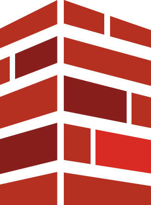

# 소개

**BlockCanvas**는 마인크래프트 건축에 집중한 서버와, 작품을 전시·관리하는 웹 플랫폼([craftopia.work](https://craftopia.work))을 함께 제공합니다. 이 가이드는 가입부터 건축, 커뮤니티 이용까지 차근차근 안내합니다.


처음이라면 [**시작하기**](getting-started/) 부터 순서대로 읽어 주세요. 가입 → 계정 연동 → 서버 접속까지 5분이면 됩니다.


### 바로가기

|                                     |                  |
| ----------------------------------- | ---------------- |
| 🚀 [시작하기](getting-started/)         | 회원가입·계정 연동·서버 접속 |
| 🏗️ [건축 공간](building/plots.md)      | 영토(플롯)·월드 클라우드   |
| ⌨️ [인게임 명령어](reference/commands.md) | 자주 쓰는 명령어·등급     |
| 💬 [커뮤니티](community/coins.md)       | 코인·규칙·문의         |

### 한눈에 보기

* **가입**: 이메일 또는 Discord 로그인
* **연동**: 마인크래프트 정품(Microsoft 로그인 권장) + Discord
* **접속**: 마인크래프트 자바 에디션 정품 클라이언트
* **규칙**: 테러·그리핑 금지 · 핵/치트 금지 · 서로 존중

### 관련 문서

* [이용약관](https://craftopia.work/terms)
* [개인정보처리방침](https://craftopia.work/privacy)
