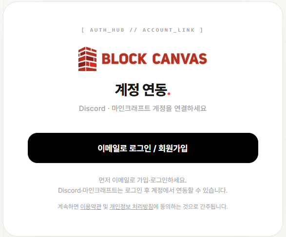

# 플랫폼 연동

먼저, [http://auth.craftopia.work/](http://auth.craftopia.work/) 에서 본 사이트 회원가입을 진행합니다.

<figure><figcaption></figcaption></figure>

## 📧 이메일로 가입

1. 가입 페이지에서 **이메일·비밀번호·닉네임**을 입력합니다.
2. 가입 시 발송되는 **인증 메일의 링크**를 눌러 이메일을 인증합니다.
3. 인증이 끝나면 로그인할 수 있습니다.


비밀번호는 **10자 이상**이며 **특수문자를 포함**해야 합니다.


이메일 가입이 완료되었다면,\
\- [http://auth.craftopia.work/](http://auth.craftopia.work/) \
\- 혹은, 내 개인 대시보드 → 외부 계정연동

<figure><figcaption></figcaption></figure> <figure><figcaption></figcaption></figure>

을 통해 다음과을같이 연동해주시기바랍니다.   \
1\. **Discord 계정연동**\
&#x20;        \- 서버참여필수 : [https://discord.gg/xbA5Y5QWf5](https://discord.gg/xbA5Y5QWf5)\
2\. **Minecraft 계정연동**\
&#x20;          \- 마이크로소프트 계정 ( 마인크래프트 Java Edition을 구매한 Xbox 계정 )

***

자세히 보기: [**계정 연동**](account-linking.md) — 마인크래프트와 Discord를 연결하세요.

