총 평가 정리 _2026_05_28

1. 텍스트 에디터 비디오/오디오 블록 
    - 칭찬할 점 1,
    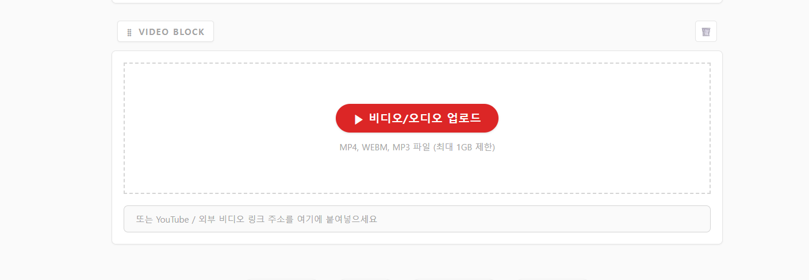 다음과 같이 수정한 것은 좋으나 링크에 대한 정보를 좀 더 잘보이게 할 것

    - 문제점 1,
    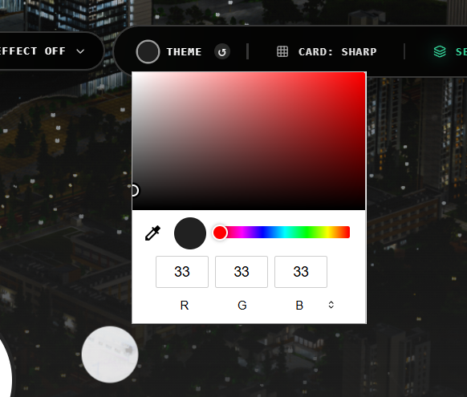 그래서 원형 테마 탭 어디감? 왜 사각형으로 되있지.

2. 텍스트 에디터 텍스트 블록
    - 문제점 1,
    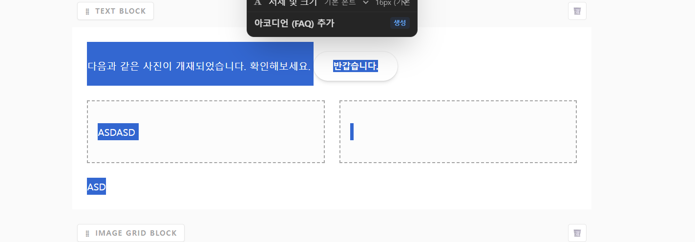  다음과 같이 Ctrl+A를 하면 단락만되게 하는 것을 요구했으나 이는 무시당함.
        >> 현재 Ctrl + A 시 텍스트 블록 전체가 선택됨.

    - 문제점 2,
    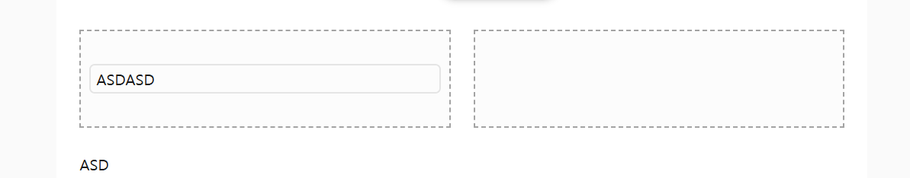 단락이 클릭이 안됨. 난 분명 단락 테두리를 클릭하면 outline과 함께 단락이 선택되게끔 요청했음.

    - 문제점 3,
    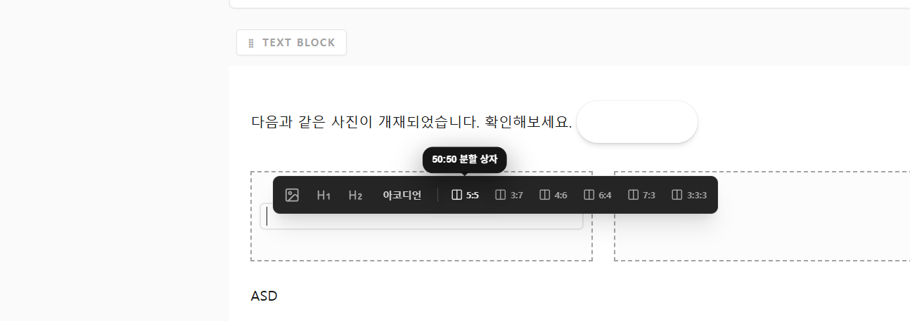 버블탭에 가이드라인은 어디갔음?

    - 문제점 4,
    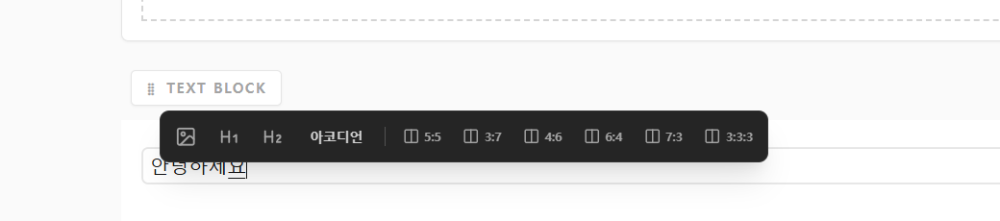 영문, 특수문자 타이핑시 관련한 버블탭이 사라지지만, 한글 작성시 버블탭이 사라지지않음 오히려 가려서 방해됨.

    - 문제점 5,
    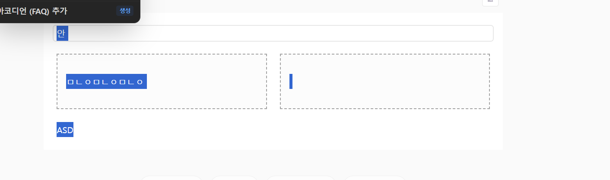 영역 드래그가 안되고 텍스트 드래그가 됨. 나는 영역드래그 기반으로 텍스트 드래그가 되었으면 함.

    - 문제점 6,
    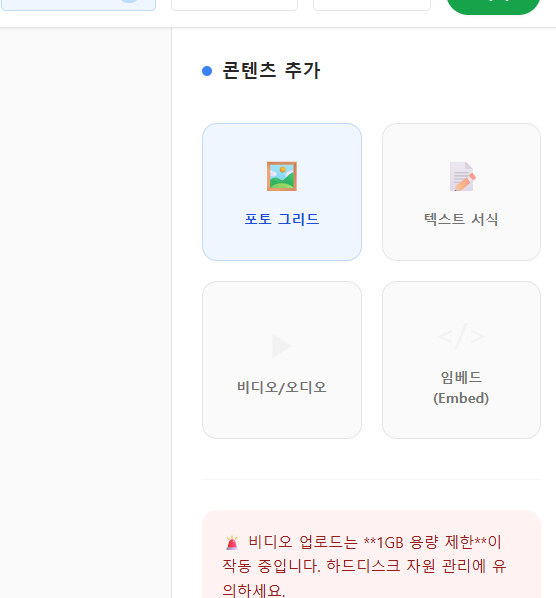 분명 각 블록 버튼에도 툴바형태의 애니메이션 가이드라인을 요구했음. 그러나 이는 무시당함.

    - 문제점 7,
    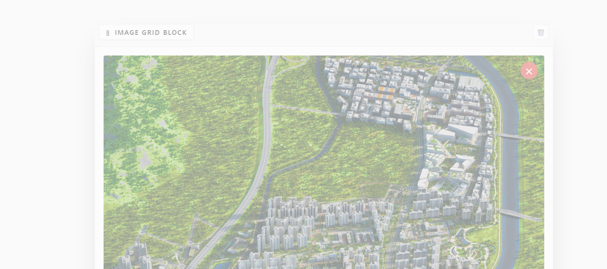 어째서, 블록 드래그 가이드라인이 없음? 난 분명 요구했음.

    - 문제점 8,
    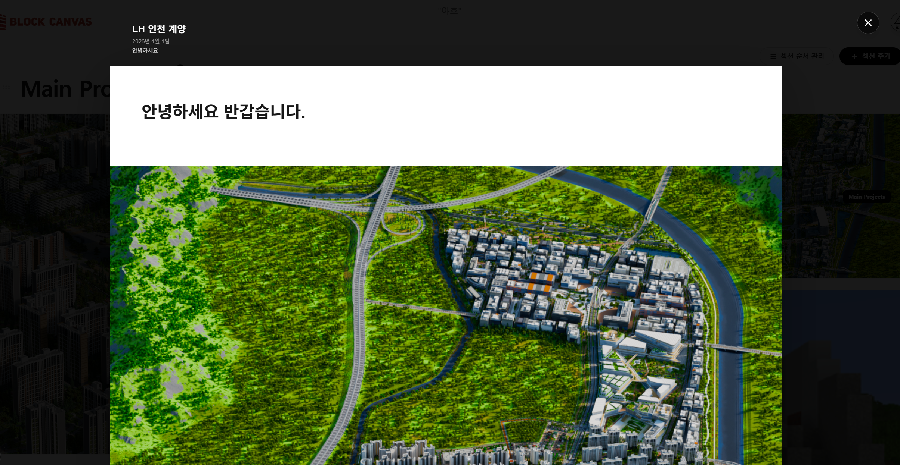 난 이런형태의 미리보기 팝업을 요구했음. 

    - 문제점 9,
    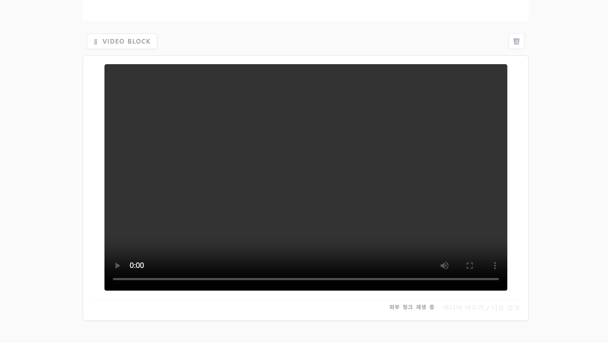 비디오/오디오 블록에서 링크 삽입시, 링크를 인식을 못함.

    - 문제점 10,
    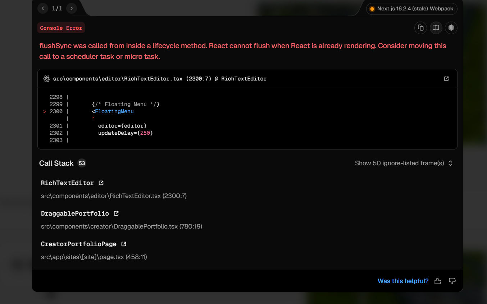 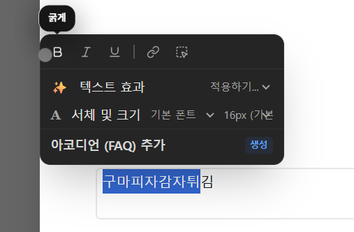 다음과 같이 텍스트 에디터에서 드래그 후 버블탭에 굵게, 기울기, 밑줄 아이콘 클릭시 다음과 같은 오류발생함.

    - 문제점 11,
    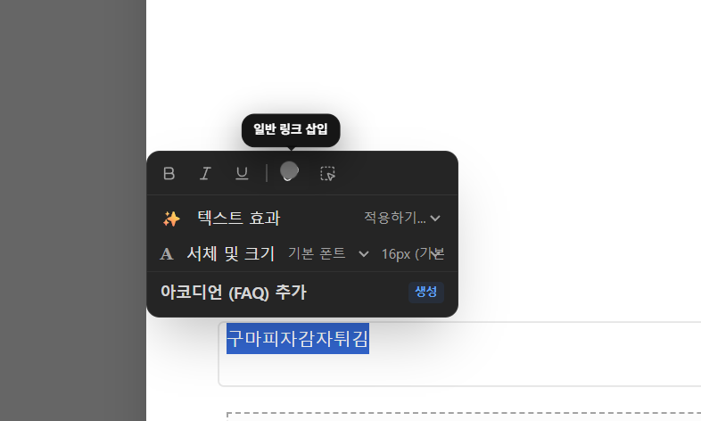 하이퍼링크 추가시 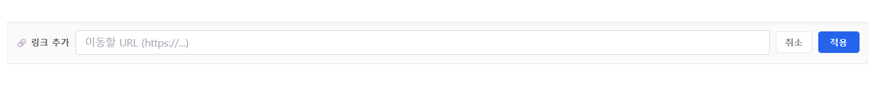 왜 상단으로 이동돼서 저런식으로뜨지 난 분명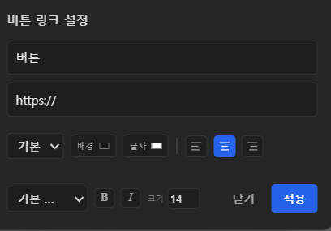 이런형태로 링크 기능 만들었는데. ( 만약 기능이 없다면 추가해. )
    또한, 하이퍼링크 삽입시 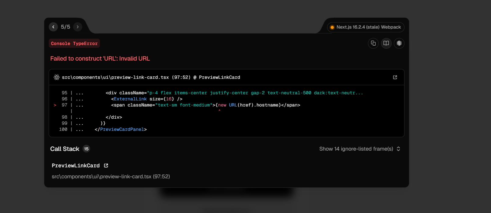 다음과 같은 문제 발생함.

3. 섹션 문제점
    - 문제점 1,
     어째서 섹션 블록은 드래그앤 드롭 기능의 가이드라인이 없음?
    
    - 문제점 2,
    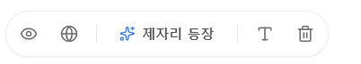 왜 이것들에 대한 가이드라인 애니메이션이 없음?

    - 문제점 3,
    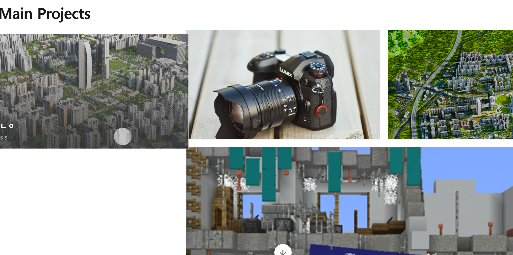 이미지 섹션 내 드래그 기능 가이드라인이 없지?

    - 문제점 4,
    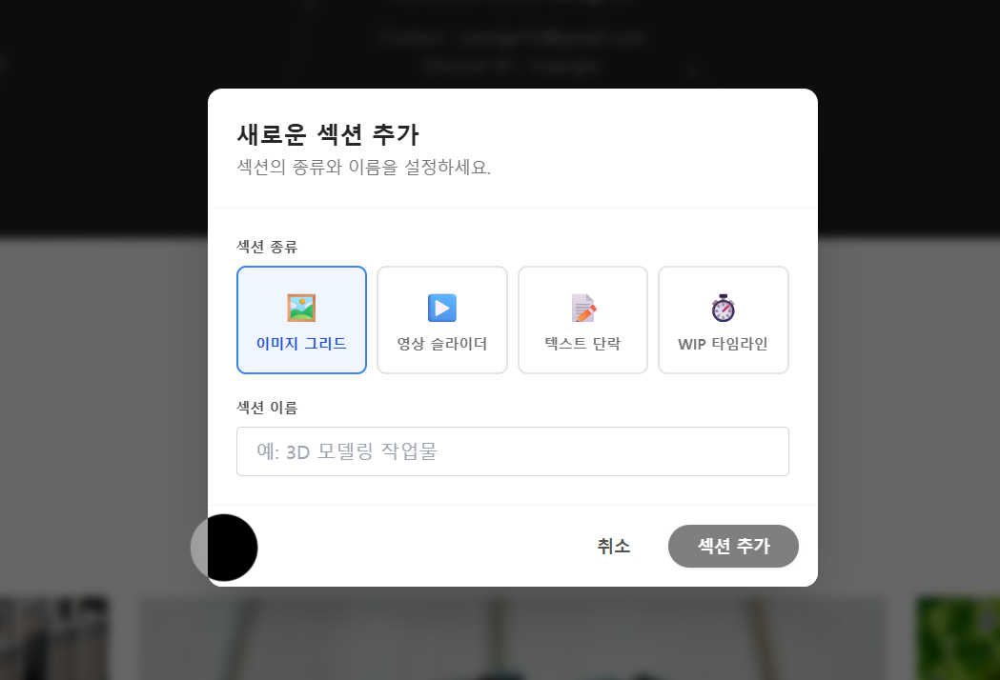 이게 그래서 뭐 어떻게 쓰는건지 뭐 내용이 한개도 없내. 난 분명 가이드라인과 좀 더 사용자들이 알 수 있게 명료한 가이드라인을 제공하라 했음.

    - 문제점 5,
    처음 사용자들이 봤을때 목록배열은 또 어떻게 쓰라는건데?

    - 문제점 6,
    
4. 아바타 Animate UI, 프로필 문제점
    - 문제점 1,
    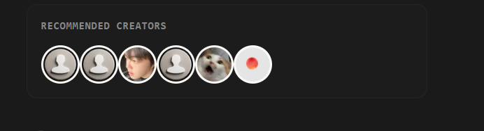 그래 푸터 좋은데 프로필 옆에 만들라고 했었는데, 내말 무시한거지? 그리고, "해당 크리에이터가 추천하는 크리에이터들만 나오게"라고 이야기했어 이말은 전체 크리에이터를 나열하라는 의미가 절대아닌데? 지금도 여전히 내가 원하는대로 기능 구현이 전혀 안된 상태야.

    - 문제점 2,
    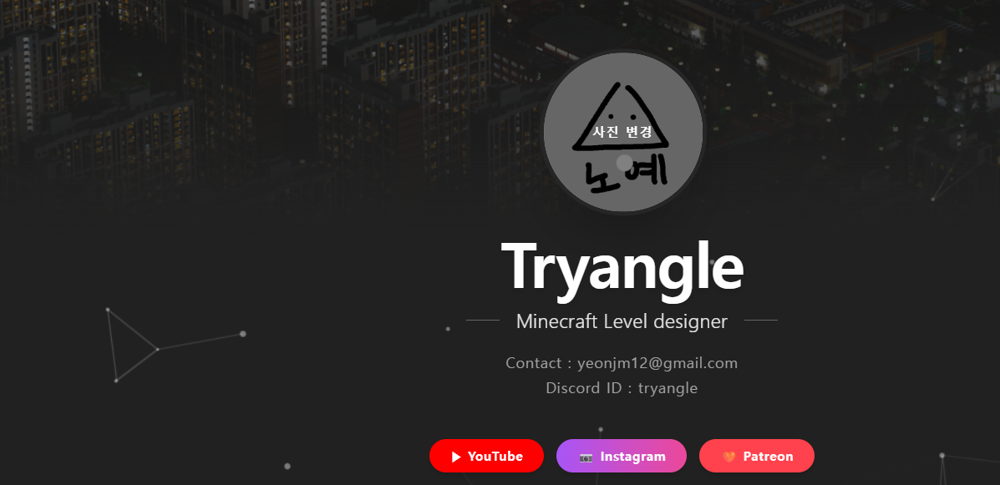 왜 프로필, 배너 변경하면 사용자가 원하는 크기로 이미지 자르는 탭이 안뜨지?

5. 비즈니스 카드
    - 문제점 1,
    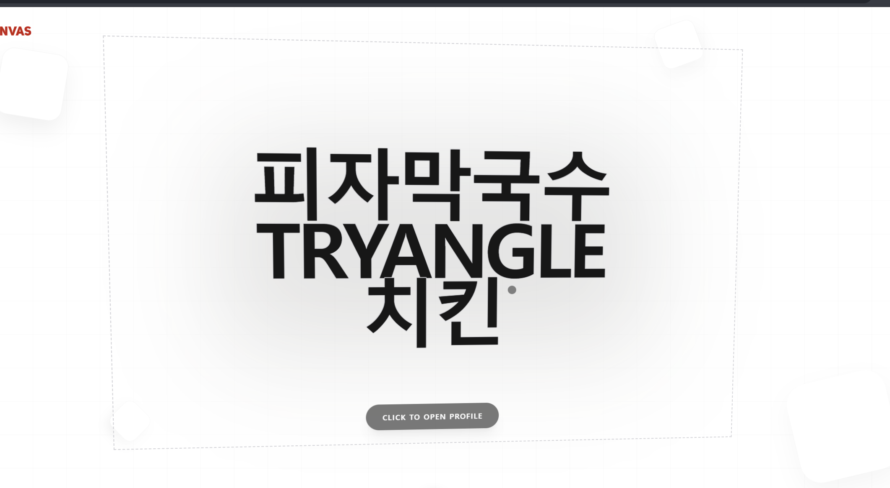 난 분명, 비즈니스 카드 점선 테두리를 좀 더 잘보이게 하고, 클릭하라는 것을 강조하라 했어.

 # 텍스트 에디터 전반적인 총평
    - 내가 요구한 것들 모두 이뤄지지 않았음 노션처럼 툴바형태의 가이드라인 애니메이션을 요구했으나 그 어디에도 가이드라인을 찾아볼 수 없음
    - 무엇을 어떻게 쓰는건지 하나도 알려주지 않고, 마구잡이 식으로 블록만 쌓은 느낌이야.
    
# 크리에이터 친화적인가?
    - 넌 누구를 위해 제작하는거지 ?  왜 사용자 입장에서 생각하지 않고, 일방적인 통보식으로 일처리하는거지 ? 

